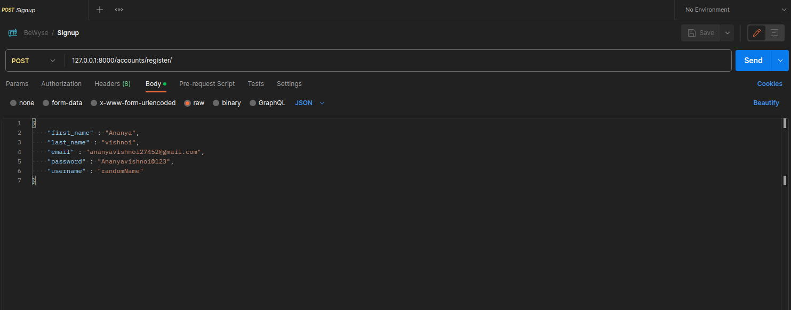
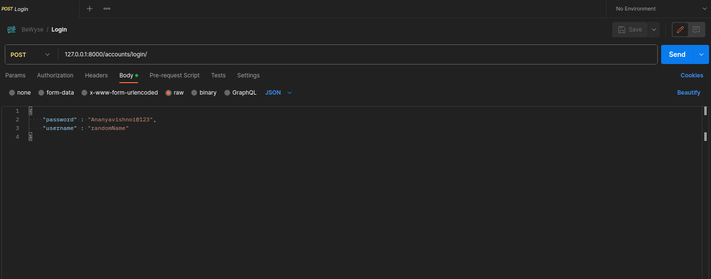
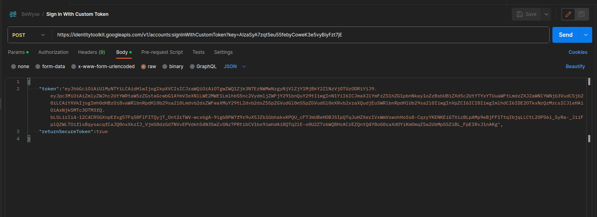
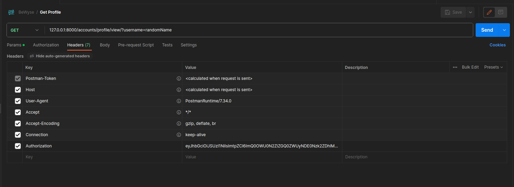
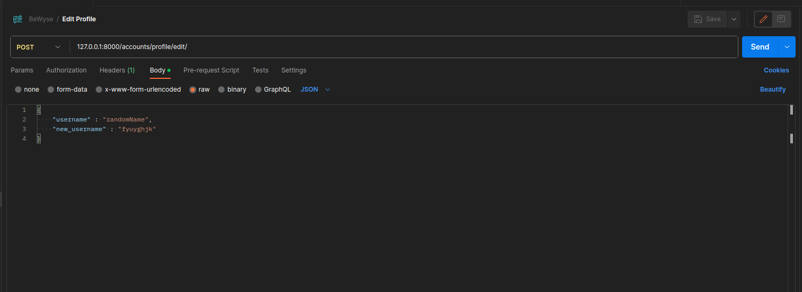

# Installation

```bash
git clone https://github.com/<your username>/<Project Name>.git
```

# Prerequisites

Before you start using this project, make sure you have the following set up:

 - Python installed on your system.
 - Django and Django REST framework installed.
 - Firebase Admin SDK for token verification.
 - MongoDB server running locally or accessible via the specified connection URL.
 
# Setup

## Virtual Environment

You can create a virtual environment for project by running the following command in your terminal:

```bash
python -m venv <name of virtual environment>
```

Once your virtual environment is created, you can activate it using the appropriate command for your operating system.

Windows:
```bash
.\<name of virtual environment>\Scripts\activate
```

Linux/Unix:
```bash
source <name of virtual environment>/bin/activate
```

By activating your virtual environment, you can ensure that any dependencies and packages you install will be isolated from your global environment, making it easier to manage and maintain your project.

## Installing Dependencies
      
To install all the necessary dependencies for your project, simply run the following command in your terminal:

```bash
pip install -r requirements.txt
```
This command will read the requirements.txt file and automatically install all the listed dependencies for you. Make sure your virtual environment is activated before running this command to ensure that the packages are installed in the correct environment. Once the installation is complete, you'll be ready to start working on your project!

# Screenshots

## Regiter new user
  


## Login User



## Verify User



## View User



## Update User




# Postman Documentation

<a href="https://documenter.getpostman.com/view/22854679/2s9YXfa34w">Postman Documentation</a>


